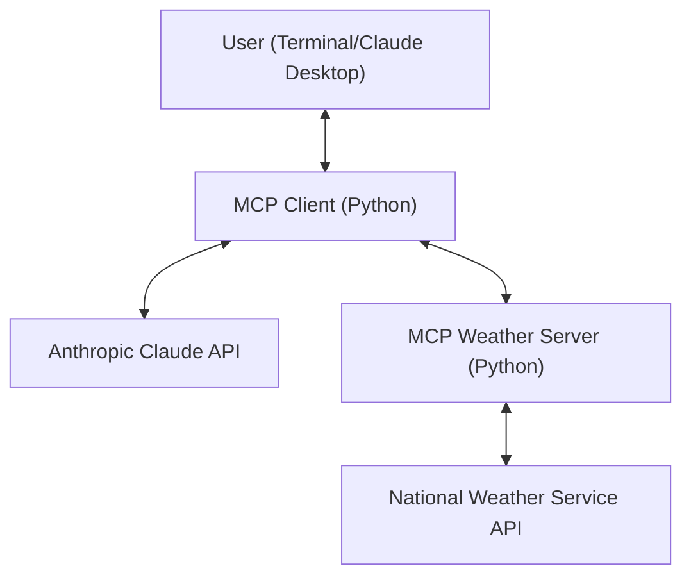

# Weather MCP: Advanced Model Context Protocol Platform

Weather MCP is a robust, production-ready implementation of the Model Context Protocol (MCP) in Python. It features a modular weather data server and a powerful client, demonstrating real-world LLM tool integration, secure API handling, and scalable architecture.

---

## 🚀 Features

- **MCP Weather Server**: Exposes weather alerts and forecasts as callable tools for LLMs, using the National Weather Service API.
- **MCP Client**: Securely connects to any MCP server, supports Anthropic Claude integration, and demonstrates dynamic tool invocation.
- **Extensible Architecture**: Easily add new tools, resources, or prompts for any LLM workflow.
- **Security Best Practices**: Environment-based secrets, strict .gitignore, and no sensitive data in code.
- **Modern Python Project Structure**: Isolated environments for server and client, ready for CI/CD and cloud deployment.

---

## 🏗️ System Architecture



---

## 📂 Directory Structure

```
weather-mcp/
├── weather/
│   ├── weather.py         # MCP server implementation
│   ├── .gitignore
│   └── mcp-client/
│       ├── client.py      # MCP client implementation
│       ├── .gitignore
│       └── ...
├── README.md
└── ...
```

---

## 🖥️ Example Usage

### Interactive Client Session

```shell
$ python client.py ../weather.py
Connected to server with tools: ['get_alerts', 'get_forecast']

MCP Client Started!
Type your queries or 'quit' to exit.

Query: What’s the weather in Sacramento?
... (response from server)
```

---

## ⚙️ Setup

### 1. Clone the Repository
```sh
git clone https://github.com/Rahul-Kaura/weather-mcp.git
cd weather-mcp
```

### 2. Set Up the Server
```sh
cd weather
uv venv
source .venv/bin/activate
uv add "mcp[cli]" httpx
```

### 3. Set Up the Client
```sh
cd mcp-client
uv venv
source .venv/bin/activate
uv add mcp anthropic python-dotenv
```

### 4. Add Your Anthropic API Key
Create a `.env` file in `weather/mcp-client/`:
```
ANTHROPIC_API_KEY=your-anthropic-api-key-here
```

---

## 🛡️ Security & Best Practices

- `.env` and `.venv` are git-ignored for safety.
- **Never commit your API keys or secrets.**
- Modular codebase for easy extension and integration with other LLMs or APIs.

---

## 📈 Extending the Platform

- Add new tools to the server by decorating Python functions with `@mcp.tool()`.
- Integrate with other LLMs or APIs by updating the client logic.
- Ready for deployment on cloud platforms or integration with enterprise workflows.

---

## 📚 References

- [Model Context Protocol Quickstart](https://modelcontextprotocol.io/quickstart/server)
- [MCP Python SDK on PyPI](https://pypi.org/project/mcp/)

---

Feel free to fork, star, and contribute! 